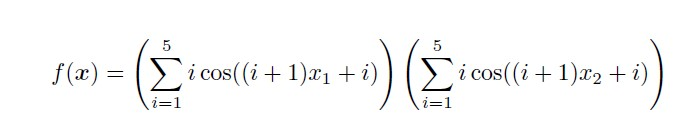

# Otimização_Multimodal_GA
Aplicação da função de otimização multimodal para encontrar o mínimo local, utilizando-se a abordagem de algoritmos genéticos

## Descrição 

<ul>
  <li> Os números do espaço de estados são gerados aleatoriamente no intervalo de -10 a 10, com 4 casas decimais </li>
  <li> O objetivo é encontrar o mínimo global </li>
  <li> Parâmetros: tamanho da população, número de gerações, probabilidade de mutação e probabilidade de cruzamento </li>
</ul>

